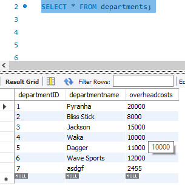

# bamazonCustomer
**Purpose:**

This application allows a user to choose a product from a list of available items in an inventory, specify a quantity and then choose to order the goods. 

**Instructions:**
1. Upon intiating the node application _node bamazonCustomer.js_, the user is presented with a table of products and prices sourced from the products table of a database from which they may choose to order a quantity of an item.
1. A succession of prompts then guides the user into selecting a product, nominating a quantity of units, confirming the order and placing the order. Data validation prevents use of text, empty entries or invalid entries (eg text where a number is expected, no entry or entry of an id that does not exist in the database respectively).
1. The user has the option to proceed or cancel the order at the point of order confirmation.
    1. If choosing to proceed with the offer, it is executed and a message confirming the way in which the order will proceed is provided (which product, how many and whether any are on back order or not). Additional options for proceeding are offered if the order is unable to be filled from stock and requires back ordering. The database is updated if the order is filled or, in the case where the entire order cannot be covered by stock, a back order is created to fill the order as requested by the user. Fields updated in the database include the remaining stock (reduced by the quantity in the order for the product chosen), back order quantity (adjusted if any additional items were required to be added to the back order quantity) and productsales (adjusted to add the value of the current order to the existing value in the productsales column).
    1. If choosing to cancel the order, it is purged. 
1. At the conclusion of ordering, the user is offered the chance to review other products or exit the application.
    1. If choosing to exit, the user is called a Legend or a whiny little bitch depending on whether they bought a new paddling tool or not, the database connection is closed and the application finishes.
    1. If the user chooses to review and/or order other items of stock, they are shown the products table again and the process starts again from 1.

<table border="1">
    <thead>
        <tr>
            <th>Products table prior to any orders being placed</th>
            <th>After ordering product with no stock on hand</th>
        </tr>
    </thead>
    <tbody>
        <tr>
            <td></td>
            <td></td>
        </tr>
        <tr>
            <th>After ordering product which can be completely filled from stock</th>
            <th>After ordering product which can be partially filled from stock</th>
        </tr>
        <tr>
            <td>
              
            </td>
            <td>
              
            </td>
        </tr>
        <tr>
            <th colspan=2>Demonstration of bamazon Supervisor application</th>
        </tr>
        <tr>
            <td colspan=2 style="text-align:center">
              <a href="assets/images/Demonstration of bamazonCustomer.webm">Demonstration of bamazonCustomer.js</a>
            </td>
        </tr>
    </tbody>
</table>

# bamazonManager
**Purpose:**

This application permits manager level reporting and access to the database for the purpose of some low level database management activities. The functions are detailed below. 

**General:**

Upon intiating the node application _node bamazonManager.js_, the manager is presented with four database management level options to choose from:
1. View products for sale
1. View low inventory
1. Add to inventory
1. Add new product

**View products for sale:**
1. Upon choosing this option, the contents of the products table from the bamazon database are displayed.
1. The manager is then presented with options to exit or go back to the main menu.
    1. If the manager chooses to exit, the database connection is closed and the application finishes
    1. If the manager chooses to go back to the main menu, they are navigated back to the restart at the General section above.

**View low inventory:**
1. Upon choosing this option, the contents of the products table with an inventory level lower than five from the bamazon database are displayed.
1. The manager is then presented with options to exit or go back to the main menu.
    1. If the manager chooses to exit, the database connection is closed and the application finishes
    1. If the manager chooses to go back to the main menu, they are navigated back to the restart at the General section above.

**Add to inventory:**
1. Upon choosing this option, the manager is presented with a list of the products available in the products table of the bamazon database to choose from for the purpose of updating.
1. The manager chooses the product to update.
1. The manager is prompted to enter the quantity of units to be added to the inventory. This entry has validation requiring a non-zero number.
1. If the product has a non-NULL and non-nil back order quantity in the products table, the manager is prompted to confirm they wish to proceed with the current number of units to be added to inventory if it doesn't match the back order quantity.
    1. Choosing to not proceed results in the manager being reprompted for the quantity of units to be added to the inventory.
    1. Choosing to proceed can have two outcomes depending on whether the amount nominated to add to inventory is greater than the existing back order quantity or not.
        1. If the quantity nominated to be added is greater than the back order quantity, the extra units are added to the units currently in stock and the back order quantity is set to zero.
        1. If the quantity nominated to be added is less than or equal to the back order quantity, the manager can opt to subtract the incoming quantity from the back order quantity or set the back order quantity to zero. The extra units are also added to the units currently in stock.
1. Once the products table has successfully had the stockqty and backorder columns updated, a confirmation is provided advising the final value of the stock holdings (existing units + new units) and backorder (previous quantity - new units or 0 whichever is greater).

**Add new product:**
1. Upon choosing this option, the manager is presented with a succession of prompts asking for the following information:
    * product name
    * department to which product belongs
    * sell price for the product
    * stocked units for this product
    * back order quantity for this product
1. The sell price, stocked units and back order quantity have validation requiring a number entry (a zero entry is permissible).
1. Business rules have been applied to the sell price requiring a confirmation by the manager if the entered price is less than 700 or greater than 2000. Once the price has been accepted as is or a new price has been re-entered it is not re-checked again in the context of the 2000 < price < 700 until the check of the entire data set as noted below
1. The manager is then presented with a summary of the details of the new product and can optionally accept the record or reject
    1. If the data is accepted, the record is inserted into the products table of the database.
    1. If the data is not accepted the manager is presented with three options to choose from.
        1. Re-enter the record which takes control back to step 1 above.
        1. Go back to the main menu which takes control to the menu allowing choices to view the products table, view low inventory etc..
        1. Exit the application and close the database connection.

# bamazonSupervisor
**Purpose:**

This application permits personnel with supervisor level access to view the productsales and profitability by department and to add other departments to the departments table. The functions are detailed below. 

**General:**

Upon intiating the node application _node bamazonSupervisor.js_, the supervisor is presented with two database supervisor level options to choose from:
1. View products sales by department
1. Create new department

**View products sales by department**
1. The supervisor is presented with a table showing the results of a query which performs aggregate functions on the productsales column and also calculates the totalprofit given the overheadcosts and aggregate of productsales for each department. Results are obtained by left joining (in order to get new departments just added which do not yet have productsales) the department and products table and the results are grouped by the departmentID, departmentname and overhead costs.

**Create new department**
1. The supervisor is asked for the name of the new department and the overheads for the new department. The new department name is required to be non-empty and the overheads is required to be a non-empty number (zero is permissible).
1. The manager is then presented with a summary of the details of the new department and can optionally accept the record or reject
    1. If the data is accepted, the record is inserted into the departments table of the database.
    1. If the data is not accepted the supervisor is presented with three options to choose from.
        1. Re-enter the record which takes control back to step 1 above.
        1. Go back to the main menu which takes control to the menu allowing choices to view product sales by department or create new department.
        1. Exit the application and close the database connection.

<table border="1">
    <thead>
        <tr>
            <th>Department Overheads</th>
            <th>Product sales by department</th>
        </tr>
    </thead>
    <tbody>
        <tr>
            <td></td>
            <td></td>
        </tr>
        <tr>
            <th colspan=2>Total Profit</th>
        </tr>
        <tr>
            <td colspan=2>
              
            </td>
        </tr>
        <tr>
            <th colspan=2>Demonstration of bamazon Supervisor application</th>
        </tr>
        <tr>
            <td colspan=2 style="text-align:center">
              <a href="assets/images/Demonstration of bamazonSupervisor.webm">Demonstration of bamazonSupervisor.js</a>
            </td>
        </tr>
    </tbody>
</table>

